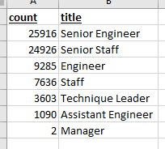

# Pewlett Hackard Retirement Mentorship Program Analysis

## Analysis Overview

Pewlett Hackard is anticipating a large number of retirements based on the current age and retirement eligibility of the staff.  To prepare for this wave, they requested an analysis for reviewing the staff that would be eligible for a mentorship program.  The program would provide a way for experienced, successful retirement eligible employees to step back into part-time roles and mentor newly hired employees.  This would be a bridge step instead of all the employees retiring fully.  

## Analysis Results

For our initial analysis, we queried the employee database to determine 1) the number of employees that are more likely to retire because they were born between the years of 1952 and 1955, and 2) a list of employees that would be eligible for the proposed Mentorship Program where eligibility is that they were born in 1965.  Below we've provided four points of interest based on our analysis:

1. 72,458 employees that are in our retirement window from 1952 to 1955 - List of employees can be viewed [here](https://github.com/amykatherines/Pewlett-Hackard-Analysis/blob/main/Data/Retirement_Titles.csv)

2. Only 7 unique employee titles exist for the list of 72k retirement eligible employees (Fig #1 below).
3. Approximately 1/3 of the list of retiring employees are "Senior Engineers" and another 1/3 are "Senior Staff" (Fig #1 below)  

Fig #1

4. 1,549 employees are eligible for the mentorship program with the constraints being that they are a current employee that was born in 1965 - List available [here](https://github.com/amykatherines/Pewlett-Hackard-Analysis/blob/main/Data/mentorship_eligibility.csv)

## Summary

Results: Provide a bulleted list with four major points from the two analysis deliverables. Use images as support where needed.
Summary: Provide high-level responses to the following questions, then provide two additional queries or tables that may provide more insight into the upcoming "silver tsunami."
How many roles will need to be filled as the "silver tsunami" begins to make an impact?
Are there enough qualified, retirement-ready employees in the departments to mentor the next generation of Pewlett Hackard employees?
