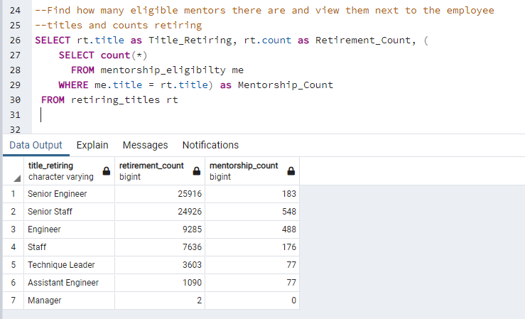

# Pewlett Hackard Retirement Mentorship Program Analysis

## Analysis Overview

Pewlett Hackard is anticipating a significant number of retirements based on the current age and retirement eligibility of the staff.  To prepare for this wave, they requested an analysis for reviewing the staff that would be eligible for a mentorship program.  The program would provide a way for experienced, successful retirement eligible employees to step back into part-time roles and mentor newly hired employees.  This would be a bridge step instead of all the employees retiring fully.  

## Analysis Results

For our initial analysis, we queried the employee database to determine 1) the number of employees that are more likely to retire because they were born between the years of 1952 and 1955, and 2) a list of employees that would be eligible for the proposed Mentorship Program where eligibility is that they were born in 1965.  Below we've provided four points of interest based on our analysis:

1. 72,458 employees are in our retirement window from 1952 to 1955 - List of employees can be downloaded from [here](https://github.com/amykatherines/Pewlett-Hackard-Analysis/blob/main/Data/retirement_titles.csv).

2. Only 7 unique employee titles exist for the list of 72k retirement eligible employees (Fig #1 below).  
3. Approximately 1/3 of the list of retiring employees are "Senior Engineers" and another 1/3 are "Senior Staff" (Fig #1 below).

Fig #1

4. 1,549 employees are eligible for the mentorship program with the constraints being that they are a current employee that was born in 1965 - List available [here](https://github.com/amykatherines/Pewlett-Hackard-Analysis/blob/main/Data/mentorship_eligibility.csv).

## Challenge Questions & Summary

How many roles will need to be filled as the "silver tsunami" begins to make an impact?  There are ~72,000 employees that might retire in the Silver Tsunami the company is preparing for.  Within this group of people, they represent 7 job descriptions, with the most significant needs being in Senior Engineers and Senior Staff. 

Are there enough qualified, retirement-ready employees in the departments to mentor the next generation of Pewlett Hackard employees?  Below is an image that shows the number of employees per job title that are retiring versus the number of mentorship candidates for those same titles.

In the image, it shows that there are very few mentors compared to retirees in most of the title categories.  My opinion would be that there are not enough mentors.

In reviewing the requests for analysis, the age range for mentorship qualification stands out as being quite narrow.  To test to see if we'd get to a better threshold of mentor candidates, I expanded the search to be the same number of years as the retirement range.  In looking at mentorship candidates from 1962 to 1965, we can see that we get significantly higher numbers.  Below are the queries and results that were use to look at this data.

In summary, we have provided some high-level information about the Silver Tsunami risk mitigation strategy of mentorship.  Reviewing the data, a broad discussion could be had if it's strictly about numbers. However, in my opinion, the database has too little information on the employees' specific roles to provide a strong analysis on this mitigation strategy for a very high-risk issue the company is facing.  
